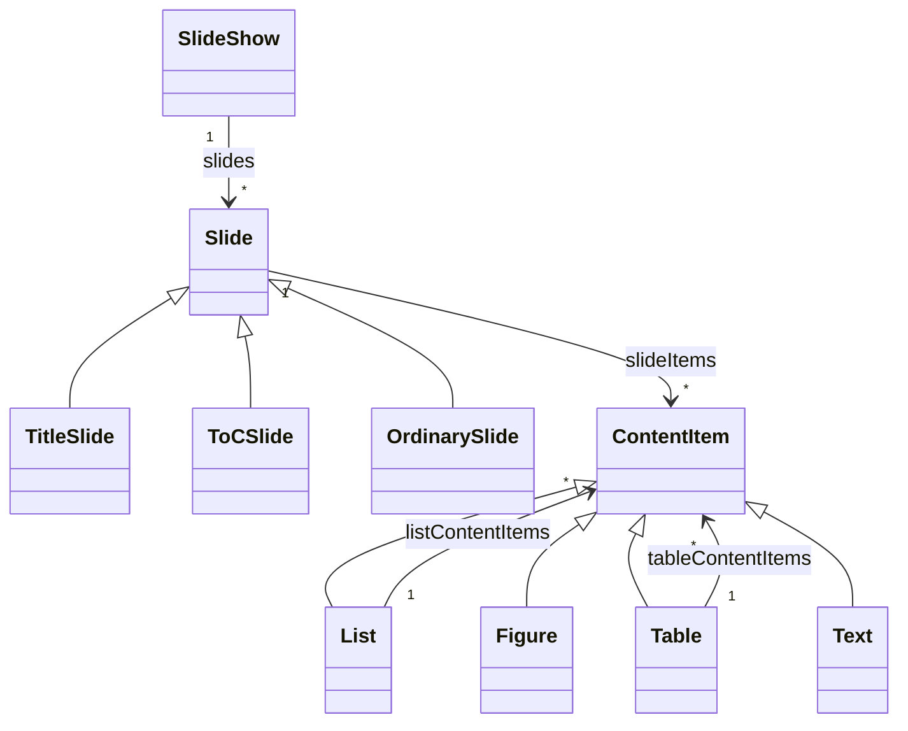

# Ubiquitous language

Develop a ubiquitous language for the domain of a slide show.

# Entities

| Concept | Sub concept | Meaning | Remarks |
|---------|-------------|---------|---------|
| slide show |  | an ordered sequence of slides |  |
|  |  | has a title |  |
|  |  | name(s) of presenter(s) |
|  |  | title |
|  |  | optional subtitle |
|  |  | number of slides |
|  | meta information | the set of slide show attributes that can be used outside the slide show itself, e.g. for generated content | Meta information is strongly linked to the slide show. Whether or not is will be modeled as a separate class in the design model, does not need to influence where it is mentioned in the UL. Mentioning it as a separate concept probably just confuses the domain experts. |
| slide |  | a single page of information formed by a content item, optionally combined with generated content based on meta information |  |
|  |  | current slide number |  |
|  |  | slide title |  |
|  | meta information | the set of slide show attributes that can be used outside the slide show itself, e.g. for generated content | See remark for slide show meta information. |
|  | title slide | shows _only_ meta information or part of it in a styling that may differ from the style of ordinary slides |  |
|  | table of contents slide | shows the titles of the ordinary slides in order                                           |  |
|  | ordinary slide | contains a single content item alongside part or all of the meta information. |  |
| content item | list | can be a bulleted list |  |
|  |  | has levels |  |
|  |  | has indenting based on level |  |
|  |  | has styling based on level |  |
|  | figure | has reference to an image source |  |
|  | table | information in table format |  |
|  | text | information as text |  |
| presenter(s) |  | the person(s) presenting the slide show |  |

# Actions

## Next slide action

| Aspect | Details | Remarks |
|--------|---------|---------|
| initiator | presenter |  |
| when | slide show is shown | |
| rules | next slide rule |  |
| related | slide |  |
| information | the next slide |  |

## Previous slide action

| Aspect | Details | Remarks |
|--------|---------|---------|
| initiator | presenter |  |
| when | slide show is shown |  |
| rules | previous slide rule |  |
| related | slide |  |
| information | the previous slide |  |

## Start slide show action

| Aspect | Details | Remarks |
|--------|---------|---------|
| initiator | presenter |  |
| when | no slide show is shown |  |
| rules | \- |  |
| related | slide show |  |
| information | slide to start with |  |

## Exit slide show action

| Aspect | Details | Remarks |
|--------|---------|---------|
| initiator | presenter |  |
| when | slide show is shown |  |
| rules | \- |  |
| related | slide show |  |
| information | \- |  |

# Rules

## Next slide rule

This rule is an _action rule_ for the _Next slide action_.

- in general: The conditions that determine if the next slide action is possible.
- specific: Possible if there is a next slide

## Previous slide rule

This rule is an _action rule_ for the _Previous slide action_.

- in general: The conditions that determine if the previous slide action is possible.
- specific: Possible if there is a previous slide

