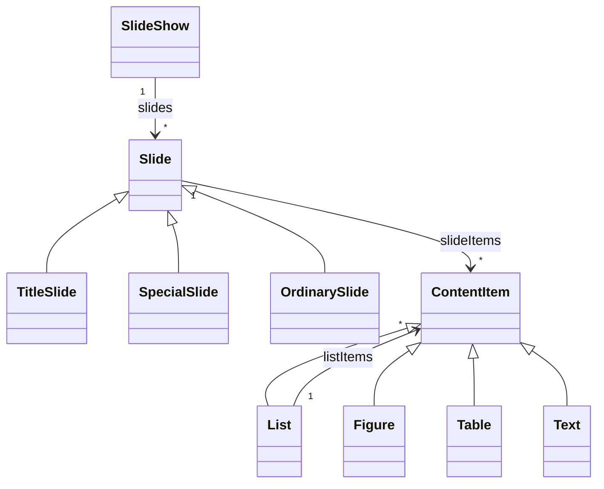

[[_TOC_]]

# Ubiquitous language

Develop a ubiquitous language for the domain of a slide show.

# Entities

| Concept | Sub concept | Meaning | Remarks |
|---------|-------------|---------|---------|
| slide show |  | a sequence of slides |  |
|  |  | contains the order of slides |  |
|  |  | has a title |  |
|  |  | has meta information |**SebastienBo**: Do slideshows also have MetaInformation? I thought MetaInformation only exists on Slides  |
| slide |  | shows information |  |
|  |  | has meta information |  |
|  | title slide | shows _only_ meta information in a big format | **StefaanB**: I'm not sure about having this as a separate sub concept from the special slide? |
|  | special slide | can contain meta information in a small format, this can differ from an ordinary slide |  |
|  |  | can contain generated content |  |
|  |  | can contain one or more content items |  |
|  | ordinary slide | contains standard slide elements alongside part (or possibly all) of the meta information. |  |
|  |  | contains one or more content items |  |
| meta information |  | name of presenter | **SebastienBo**: MetaInformation is not an Entity since it has no identity. I think these are all ContentItems and should be put under there. On the other hand: Presenter should be added as an entitiy. (not presenter name, which is an attribute of the presenter)   **MattanK**: This concept now has both slide show and slide meta info, should we remove meta information and put this information in slide show and slide?  **PetervN** Or we could introduce two different concepts. One for Slideshow Meta Information and one for Slide Meta Information? |
|  |  | date |  |
|  |  | slide show title | **MelvinM**: I don't think this is part of the meta information. The text says: "Usually, a slide show has a title, sometimes a subtitle, and some meta information, such as the name of the presenter, the date, and so on. The first slide, called the title slide, shows this information." |
|  |  | total number of slides |  |
|  |  | current slide number | **MelvinM**: The meta information tells something about the whole slide show and not about an individual slide. I would place it under `ContentItem` **ErikH** The 'spec' also defines current slide number as meta information. Problem is we have two types of meta information: that of a slide show and that of a slide. I think we need to reflect that in the UL by adding a concept for the slide meta information (and renaming meta information to slide show meta information). Whether we see a title as a attribute of slide and of slide show, or that we see it as part of the meta information is an arbitrary choice, but I would vote for the latter. |
|  |  | slide title | **MelvinM**: I don't think this is part of the meta information. The text says: "Usually, a slide show has a title, sometimes a subtitle, and some meta information, such as the name of the presenter, the date, and so on. The first slide, called the title slide, shows this information." **ErikH** See my comment above. I don't think this needs changing. |
| content item | list | can contain bullets |  |
|  |  | has levels |  |
|  |  | has indenting based on level |  |
|  |  | has font size based on level |  |
|  | figure | has reference to source |  |
|  | table | information in table format |  |
|  | text | information as text |  |
| marker |  | used to mark a slide | **Alessandro Lepre**: You use the marker to make adjustments or create a slide in advance. But this should not be viewed as entity for presenting specifically? **MattanK**: If we want to include this I'd suggest calling this an annotation or something like that. **ErikH** Seeing the answer about annotations (which seems similar to this and is up to us whether to add it or not), I would suggest removing it, to keep everything as simple as possible. |

# Actions

## Next slide action

| Aspect | Details | Remarks |
|--------|---------|---------|
| initiator | presenter |  |
| when | slide show is shown | |
| rules | next slide rule |  |
| related | slide |  |
| information | the next slide |  |

## Previous slide action

| Aspect | Details | Remarks |
|--------|---------|---------|
| initiator | presenter |  |
| when | slide show is shown |  |
| rules | previous slide rule |  |
| related | slide |  |
| information | the previous slide |  |

## Start slide show action

| Aspect | Details | Remarks |
|--------|---------|---------|
| initiator | presenter |  |
| when | no slide show is shown |  |
| rules | \- |  |
| related | slide show |  |
| information | slide to start with |  |

## Exit slide show action

| Aspect | Details | Remarks |
|--------|---------|---------|
| initiator | presenter |  |
| when | slide show is shown |  |
| rules | \- |  |
| related | slide show |  |
| information | \- |  |

# Rules

## Next slide rule

This rule is a _action rule_ for the _Next slide action_.

- in general: The conditions that determine if the next slide action is possible.
- specific: Possible if there is a next slide

## Previous slide rule

This rule is a _action rule_ for the _Previous slide action_.

- in general: The conditions that determine if the previous slide action is possible.
- specific: Possible if there is a previous slide

