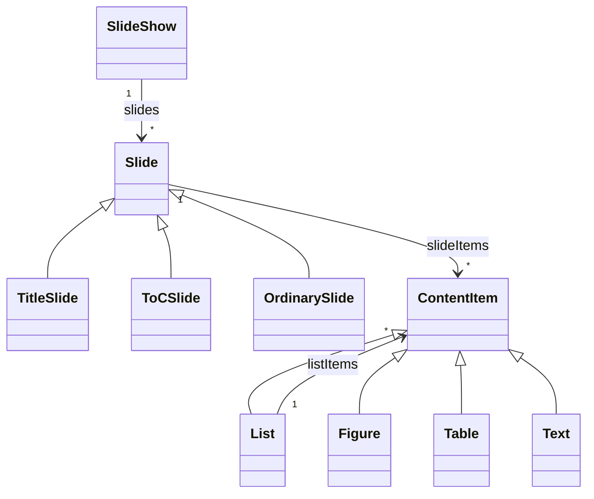

# Ubiquitous language

Develop a ubiquitous language for the domain of a slide show.

# Entities

| Concept | Sub concept | Meaning | Remarks |
|---------|-------------|---------|---------|
| slide show |  | an ordered sequence of slides |  |
|  |  | has a title |  |
|  |  | has slide show meta information |  |
| slide |  | shows information |  |
|  |  | has slide meta information |  |
|  | title slide | shows _only_ meta information or part of it in a big format | likely generated based on meta information? |
|  | table of contents slide | shows the titles of the ordinary slides in order                                           | likely generated based on meta information? |
|  | ordinary slide | contains standard slide elements alongside part (or possibly all) of the meta information. |  |
|  |  | contains one or more content items |  |
| slide show meta | | date |
|  |  | name(s) of presenter(s) |
|  |  | slide show title |
|  |  | optional subtitle |
|  |  | number of slides |
| slide meta |  | current slide number |  |
|  |  | slide title |  |
| content item | list | can contain bullets |  |
|  |  | has levels |  |
|  |  | has indenting based on level |  |
|  |  | has font size based on level |  |
|  | figure | has reference to source |  |
|  | table | information in table format |  |
|  | text | information as text |  |

# Actions

## Next slide action

| Aspect | Details | Remarks |
|--------|---------|---------|
| initiator | presenter |  |
| when | slide show is shown | |
| rules | next slide rule |  |
| related | slide |  |
| information | the next slide |  |

## Previous slide action

| Aspect | Details | Remarks |
|--------|---------|---------|
| initiator | presenter |  |
| when | slide show is shown |  |
| rules | previous slide rule |  |
| related | slide |  |
| information | the previous slide |  |

## Start slide show action

| Aspect | Details | Remarks |
|--------|---------|---------|
| initiator | presenter |  |
| when | no slide show is shown |  |
| rules | \- |  |
| related | slide show |  |
| information | slide to start with |  |

## Exit slide show action

| Aspect | Details | Remarks |
|--------|---------|---------|
| initiator | presenter |  |
| when | slide show is shown |  |
| rules | \- |  |
| related | slide show |  |
| information | \- |  |

# Rules

## Next slide rule

This rule is a _action rule_ for the _Next slide action_.

- in general: The conditions that determine if the next slide action is possible.
- specific: Possible if there is a next slide

## Previous slide rule

This rule is a _action rule_ for the _Previous slide action_.

- in general: The conditions that determine if the previous slide action is possible.
- specific: Possible if there is a previous slide

