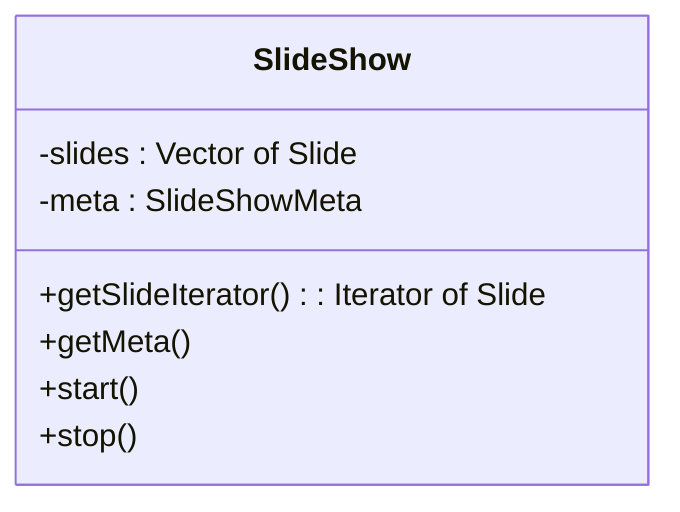
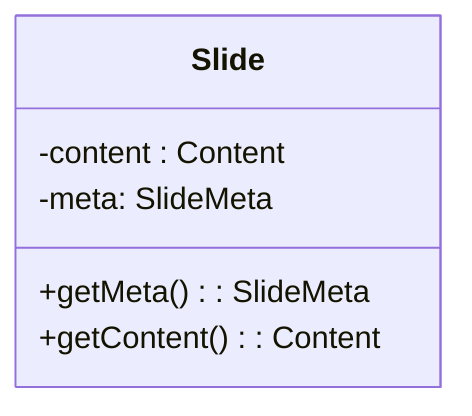
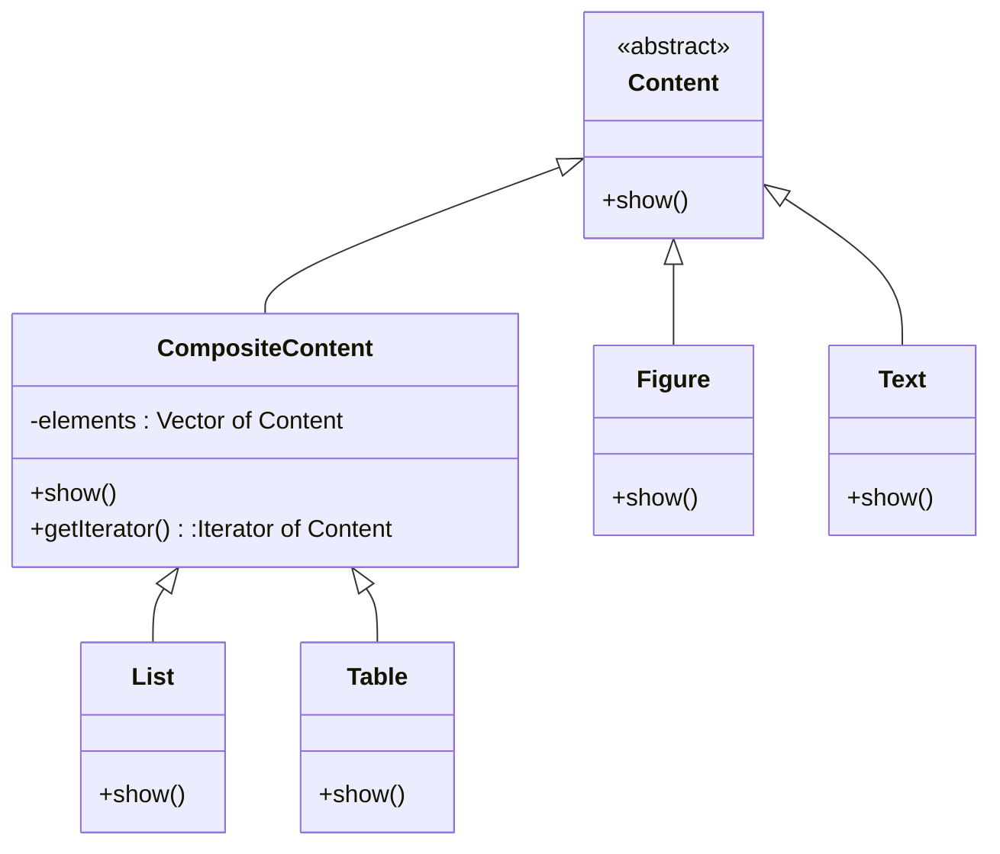
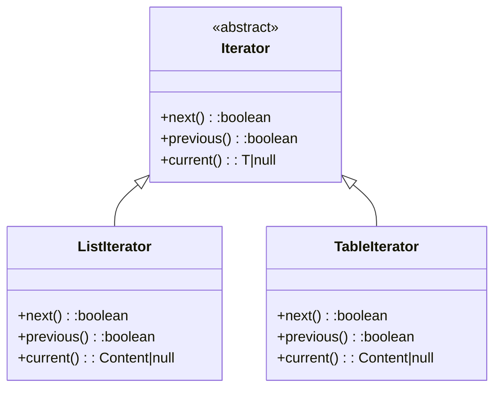

<[[_TOC_]]

# Design of the domain

Make a design for the entities in the domain of slide shows.

# Responsibilities

## Slide show

| Type | Responsibility | Comments | Remarks |
|------|----------------|----------|---------|
| Know | its slides |  |  |
|  | its meta information |  |  |
| Can | start |  | **ErikH** If I read the assignment correctly, the slide show application is started with a file parameter that contains the slide show to be shown. Do you think we should have a separate action on the slide show class to actually _start_ the slide show? I think it should automatically be started once the application starts.  **MelvinM** Agreed. In the assignment they don't talk about a start action. You want to support all kind of user configured slide shows, so I would say just make a config of a slide show and load that in. But thats a topic in a later fase ;)|
|  | stop |  |  |
|  | show next slide |  |  |
|  | show previous slide |  |  |

## Slide

| Type | Responsibility | Comments | Remarks |
|------|----------------|----------|---------|
| Know | its content |  |  |
|  | its meta information | title, slide number |  |
| Can | render its content |  |  |

## Content

| Type | Responsibility | Comments | Remarks |
|------|----------------|----------|---------|
| Know | information to be shown | for text and image |  |
|  | child content items | for table and list |  |
| Can | render its content | |  |

## SlideShow Meta
| Type | Responsibility | Comments |
|------|----------------|----------|
| Know | title | |
|      | subtitle | |
|      | presenter names | |
|      | date | |
| Can | be shown | |

## Slide Meta
| Type | Responsibility | Comments |
|------|----------------|----------|
| Know | title | |
|      | slide number in sequence | |
| Can | be shown | |

# Design

## Slide show

- Design pattern **Iterator** for navigation over the slides?

## Slide
- I doubt we will need anything more complex than a Slide, as Content should be able to handle any table of contents, title slide or other special slides 

## Content

- Design pattern **Composite** for content and its subtypes.
- **Iterator** to navigate through these

### Mapping for Composite

| Class | Role |
|-------|------|
| Content | Component |
| List | Composite |
| Table | Composite |
| Figure | Leaf |
| Text | Leaf |

## Iterator

