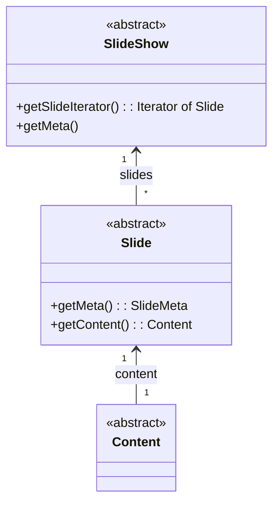
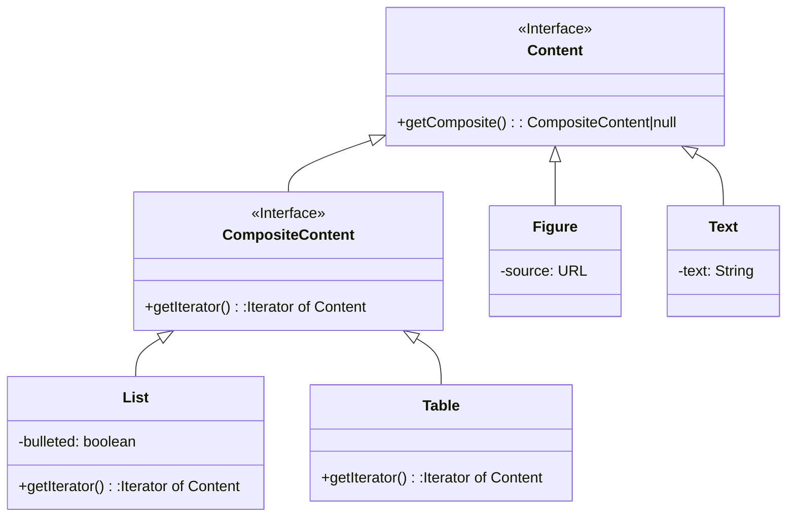
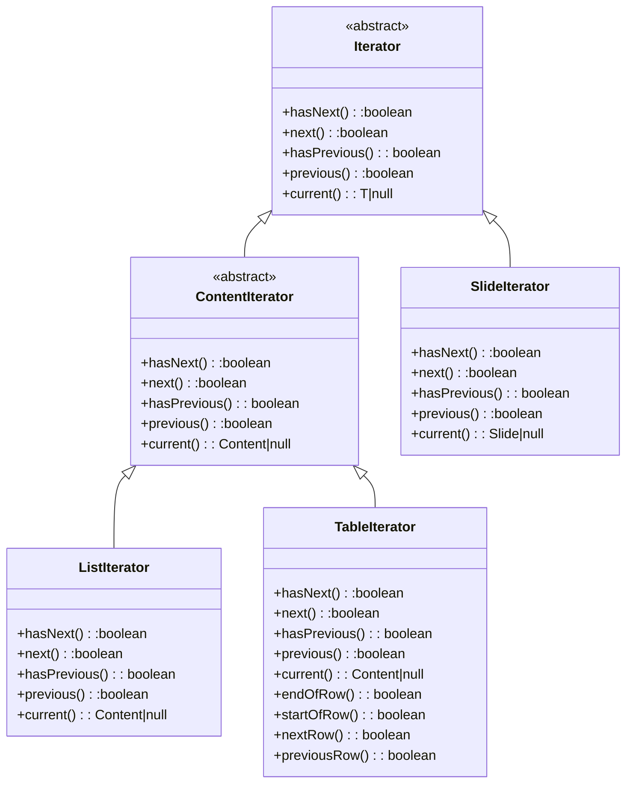

<[[_TOC_]]

# Design of the domain

Make a design for the entities in the domain of slide shows.

# Responsibilities

## Slide show

| Type | Responsibility | Comments | Remarks |
|------|----------------|----------|---------|
| Know | its slides |  |  |
|  | its meta information |  |  |
| Can  | supply slide iterator                  |  |  |

## Slide Iterator

| Type | Responsibility          | Comments | Remarks |
|------|-------------------------|----------|---------|
| Know | slides                  |  |  |
|      | current slide           | | |
| can  | navigate through slides |  |  |

## Slide

| Type | Responsibility | Comments | Remarks |
|------|----------------|----------|---------|
| Know | its content |  |  |
|  | its meta information | title, slide number |  |
| Can |  |  |  |

## Content

| Type | Responsibility | Comments | Remarks |
|------|----------------|----------|---------|
| Know | information to be shown | for text and image |  |
|  | child content items | for table and list |  |
| Can | supply content iterator | |  |

## SlideShow Meta
| Type | Responsibility | Comments |
|------|----------------|----------|
| Know | title | |
|      | subtitle | |
|      | presenter names | |
|      | date | |
| Can |  | |

## Slide Meta
| Type | Responsibility | Comments |
|------|----------------|----------|
| Know | title | |
|      | slide number in sequence | |
| Can |  | |

# Design

## Slide show and slide
- I doubt we will need anything more complex than a Slide, as Content should be able to handle any table of contents, title slide or other special slides 

## Content

- Design pattern **Composite** for content and its subtypes.
- **Iterator** to navigate through these
- It is a possibility to include Slide and even SlideShow into the Composite hierarchy. We decided against that, because we see too much difference between Slide/SlideShow and the other Components and too little shared functionality.

### Mapping for Composite

| Class | Role |
|-------|------|
| Content | Component |
| List | Composite |
| Table | Composite |
| Figure | Leaf |
| Text | Leaf |

## Iterator

## Rules

### Next slide rule
This rule does not need an explicit implementation. Is it implicit in the SlideIterator that is provided by the SlideShow. We do not foresee any situation where an explicit Rule class for this would provide benefits over using an Iterator.

### Previous slide rule
This rule does not need an explicit implementation, for the same reason as the Next slide rule.

## StopStrategy
This strategy pattern is used to give options to the application on what to do when the slide show presentation is stopped.
I do not yet know which class wil be responsible for calling methods on the StopStrategy. I guess that will be done from a (not yet existing) GUIManager class.

### ExitApplicationStopStrategy
A StopStrategy that simply exits the application.

### SelectSlideShowStopStrategy
A StopStrategy that allows the user to select a new slide show to be presented.
Note that if we want to support multiple UIs, that this will require a UI class/interface that supports this.
That means we will probably need a Bridge pattern somewhere.

~~~mermaid
classDiagram
    class StopStrategy{
        <<Interface>>
        +stop()
    }
    
    class ExitApplicationStopStrategy {
        +stop()
    }

    class SelectSlideShowStopStrategy {
        +stop()
    }

StopStrategy <|-- ExitApplicationStopStrategy
    StopStrategy <|-- SelectSlideShowStopStrategy
~~~
