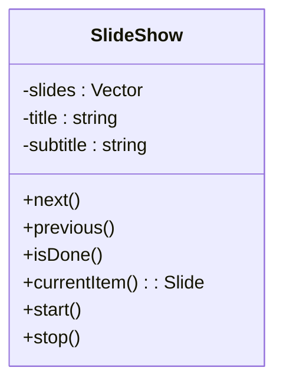
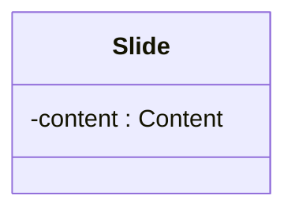
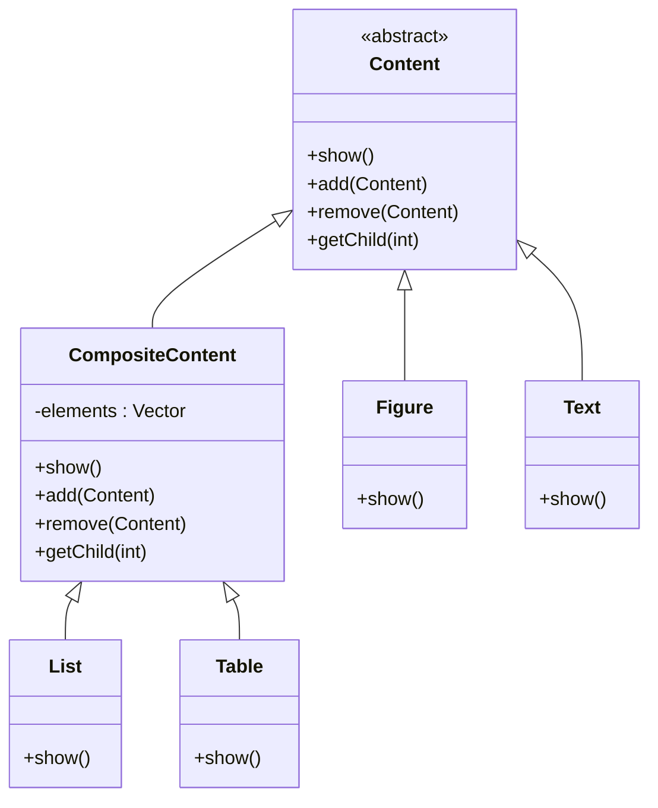

<[[_TOC_]]

# Design of the domain

Make a design for the entities in the domain of slide shows.

# Responsibilities

## Slide show

| Type | Responsibility | Comments | Remarks |
|------|----------------|----------|---------|
| Know | its slides |  |  |
|  | title |  | **ErikH** Maybe we can make title part of the meta information? We need the title to render it on the slide and I would like to only pass meta information to the slide, not the whole slide show. **BertH** Agreed, both title and subtitle should be part of the meta information. |
|  | subtitle |  |  |
|  | meta information | date, presenter | **BertH** Should multiple presenters be allowed? It's quite common for multiple people to present a single presentation.  |
|  | ? |  |  |
| Can | start |  | **ErikH** If I read the assignment correctly, the slide show application is started with a file parameter that contains the slide show to be shown. Do you think we should have a separate action on the slide show class to actually _start_ the slide show? I think it should automatically be started once the application starts.  **MelvinM** Agreed. In the assignment they don't talk about a start action. You want to support all kind of user configured slide shows, so I would say just make a config of a slide show and load that in. But thats a topic in a later fase ;)|
|  | stop |  |  |
|  | show next slide |  |  |
|  | show previous slide |  |  |
|  | ? |  |  |

## Slide

| Type | Responsibility | Comments | Remarks |
|------|----------------|----------|---------|
| Know | its content |  |  |
|  | meta information | title, slide number |  |
|  | ? |  |  |
| Can | render its content |  |  |
|  | ? |  |  |

## Content

| Type | Responsibility | Comments | Remarks |
|------|----------------|----------|---------|
| Know | information to be shown | for text and image |  |
|  | child content items | for table and list |  |
|  | ? |  |  |
| Can | render its content |  |  |
|  | ? |  |  |

# Design

**MattanK:** See https://git.cs.ou.nl/ebrahim.rahimi/design-for-change-2023-2024-q1/-/issues/8 for my new vision on the design

## Slide show

- Design pattern **Iterator** for navigation?

**ErikH** I think we could add a separate Iterator class for this. 
**WouterM** Wouldn't this be a bit overkill for traversing a list / vector of slides? If I understand correct slides will be traversed and this will simply be a list of slide objects. I would agree with you if there is some complex behaviour within each slide object that has to be traversed but this doesn't seem te be the case. 
**BertH** I doubt an iterator more complex then a next/previous option is necessary. Given the domain (analog slide show) for now a builtin iterator on a list suffices.

## Slide

- Object composition for the different types of behaviors for the subtypes of slides?
 **WouterM** What would be the part-whole hierarchy part here? I think a slide would not be able to contain different slides, which is (I think) crucial for this design pattern. **MattanK:** Composite object, not the Composite pattern (GoF book p18/19), Just saw this is actually object composition, so renamed it.
- SlideShow attribute for meta information access?

## Content

- Design pattern **Composite** for content and its subtypes.
- **Iterator** to navigate through these?
 **WouterM** Yes I agree, for the table and list items we probably want to have different ways of iteration through their respective elements. Does this mean that we need to add a getiterator method to the list and table classes?  
 **BertH** I think we need a getIterator method on the CompositeContent class/interface otherwise the Slide would need to know whether the Content is a table, a list or a specific item. I also think the add and remove methods belong on CompositeContent, not on Content. How would one add a Figure/Text inside another Figure/Text? I'd also like to propose a Header subclass of Content, as it has different properties than simple text.

### Mapping for Composite

| Class | Role |
|-------|------|
| Content | Component |
| List | Composite |
| Table | Composite |
| Figure | Leaf |
| Text | Leaf |

